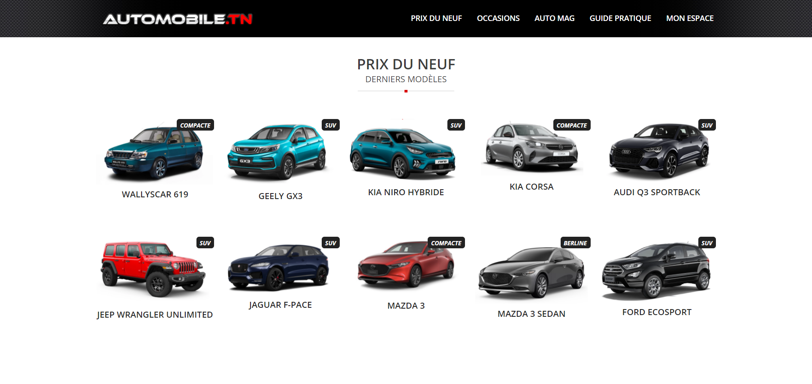
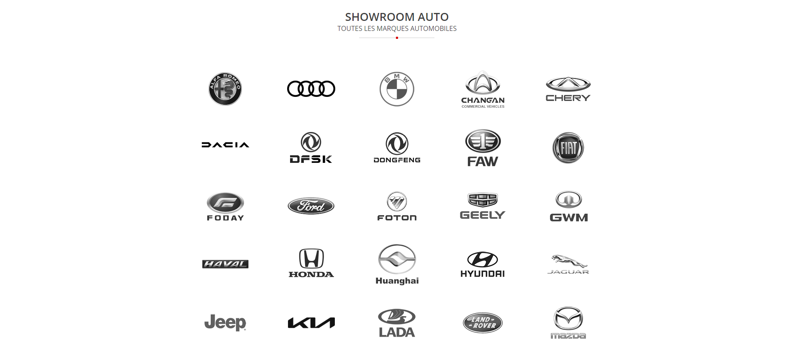

  

# Automobile.tn

Prix des voitures neuves en Tunisie, Annonces auto, Voitures d'occasion, Guide pratique, Actualités et Nouveautés, Photos et Vidéos, Fiches techniques, ...

  

  

## Scripts disponibles

Dans le répertoire du projet, vous pouvez exécuter :

### `npm start`

Exécute l'application en mode développement.\
Ouvrez [http://localhost:3000](http://localhost:3000) pour l'afficher dans le navigateur.